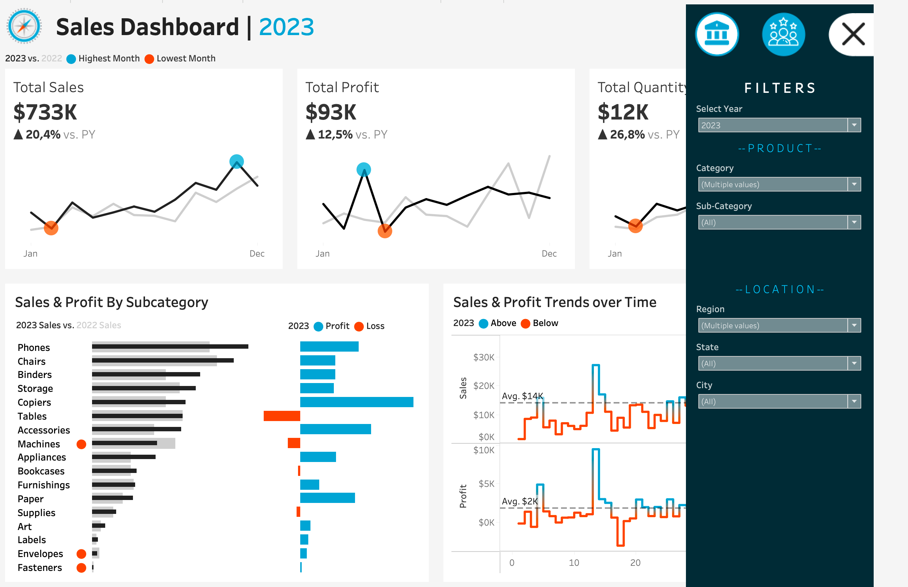

# Sales & Customer Analytics Dashboard

## Summary
This project is a Tableau-based analytics initiative designed to transform raw sales and customer data into decision-ready insights. The dashboard consolidates business performance indicators, customer behavior patterns, and regional trends into a clear, executive-friendly interface that supports smarter planning and faster strategic action.

The analysis combines transactional order data with customer, product, and location information to provide a 360-degree view of revenue generation, customer retention potential, and product performance. By turning data into visual stories, the dashboard helps stakeholders understand not just what happened, but why it happened and where opportunities exist.

---

## Business Problem: The Need for Clarity
Organizations often collect large amounts of sales and customer data, but without a structured and visual analytical layer, this information remains fragmented and difficult to act on. Leaders are frequently challenged by questions such as:

- Which products and categories are driving revenue?
- Which regions or cities show the strongest sales potential?
- How are customers behaving across segments and loyalty stages?
- Where are the inefficiencies or losses in profit and discounting?
- What strategic actions should be prioritized to improve growth?

The core problem is not lack of data, but lack of clarity. The goal of this project is to present business data in a way that is easy to understand, easy to compare, and easy to use for decision-making.

---

## Tools and Methodology: The Analytical Journey
The analytical journey began with structured data preparation and business-focused questions. The project follows a practical data analytics workflow:

1. Data collection from transactional and reference datasets.
2. Data validation to confirm integrity, consistency, and relationship keys.
3. Data blending and mapping across sales, customer, product, and geographic tables.
4. KPI identification such as sales, profit, quantity, and customer concentration.
5. Dashboard design in Tableau for interactive analysis.
6. Interpretation of trends to generate strategic insights and recommendations.

This methodology ensures the dashboard is not only visually appealing but also analytically grounded and business relevant.

---

## Source of Datasets
The project uses a combination of operational and reference files stored in the Tableau data folder:

- [tableau/data/Orders.csv](tableau/data/Orders.csv): Core sales transactions including order details, quantities, sales, discount, and profit.
- [tableau/data/Customers.csv](tableau/data/Customers.csv): Customer ID and customer name lookup table.
- [tableau/data/Products.csv](tableau/data/Products.csv): Product hierarchy including category, sub-category, and product details.
- [tableau/data/Location.csv](tableau/data/Location.csv): Geographic information such as city, state, region, and country.

These datasets provide the foundations for sales analysis, customer segmentation, and geographic performance tracking.

---

## Tech Stack
The dashboard was developed using a modern business intelligence and analytics stack centered on Tableau:

- Tableau Desktop / Tableau Workbook (.twb / .twbx) for dashboard design and interactivity
- CSV data files for source input and data modeling
- Excel-style data preparation and review for consistency checks
- Data blending and relationship mapping across multiple tables
- Visualization design principles for storytelling, KPI tracking, and comparative analysis

This stack is well suited for business dashboards where data storytelling, interactivity, and executive readability are essential.

---

## Dashboard Building Process
The dashboard building process followed a structured BI design flow:

1. Understand the business context and stakeholder questions.
2. Prepare and validate the data model using relational keys such as customer ID, product ID, and postal code.
3. Define key performance measures and dimensions.
4. Build a sales dashboard focused on revenue, profitability, and operational trends.
5. Build a customer dashboard focused on customer behavior, segment trends, and loyalty patterns.
6. Apply filters, hierarchy views, and charts for interactive exploration.
7. Refine the layout for clarity, readability, and executive presentation.

The final dashboard is intended to serve as a reusable management tool for performance review, sales monitoring, and customer insights.

---

## Skills Demonstrated
This project demonstrates a range of valuable analytics and business intelligence capabilities, including:

- Data cleaning and transformation
- Data modeling and relationship building
- Sales analysis and KPI interpretation
- Customer segmentation analysis
- Geographic analysis and regional performance comparison
- Tableau dashboard design and storytelling
- Data-driven recommendation and executive reporting
- Business communication through visuals and summaries

These skills reflect the core competencies needed in modern analytics and decision support roles.

---

## Sales Dashboard Deep Dive: Revenue and Performance
The sales dashboard focuses on the financial health of the business and the operational drivers behind revenue performance. It is designed to answer questions such as:

- Which products contribute the most to revenue?
- Which categories and sub-categories are most profitable?
- How do sales trends vary by region, state, or city?
- Are discounts negatively impacting profitability?
- Which segments or order patterns require strategic attention?

This section of the dashboard helps organizations understand where value is created and where margin leakage may occur. By combining sales, product, and geographic lenses, stakeholders can identify patterns that influence performance and support planning decisions.

---

## Customer Dashboard Deep Dive: Behavior and Loyalty
The customer dashboard is built to uncover patterns in customer engagement, purchase behavior, and potential loyalty opportunities. It helps answer questions such as:

- Which customers drive recurring value?
- Are there differences in purchasing behavior across customer segments?
- Which regions or cities contain the strongest customer concentration?
- How can customer relationships be nurtured to increase retention and repeat buying?
- Where should sales teams focus relationship-building efforts?

Customer analytics is essential because revenue growth does not come only from acquisition; it also depends on retention, engagement, and strong relationship management. This dashboard brings the customer dimension into view and supports a more strategic, targeted sales approach.

---

## Executive Insights and Strategic Recommendations
The value of this dashboard lies in its ability to convert business data into actionable decisions. Based on the structure of the project, the executive analysis can support several strategic recommendations:

- Prioritize high-performing product categories and expand their presence in growth regions.
- Review discount strategies where they are reducing margin without proportional revenue gain.
- Focus sales initiatives on regions with strong demand and high customer concentration.
- Build loyalty and retention programs around repeat buyers and high-value segments.
- Use customer segmentation to tailor promotions and service experiences.
- Monitor underperforming areas for operational or pricing intervention.

These recommendations align the dashboard with real business objectives: sustainable growth, stronger profitability, and more informed decision-making.

---

## Conclusion
This project demonstrates how sales and customer data can be transformed into a clear, interactive, and strategic dashboard that supports business understanding and leadership action. By combining transaction data, customer context, product details, and location information, the dashboard provides a practical example of modern analytics in action.

The result is not just a visual report, but a decision-support tool that helps answer core business questions with confidence. It reflects the importance of data clarity, analytical discipline, and dashboard storytelling in delivering meaningful business insight.
